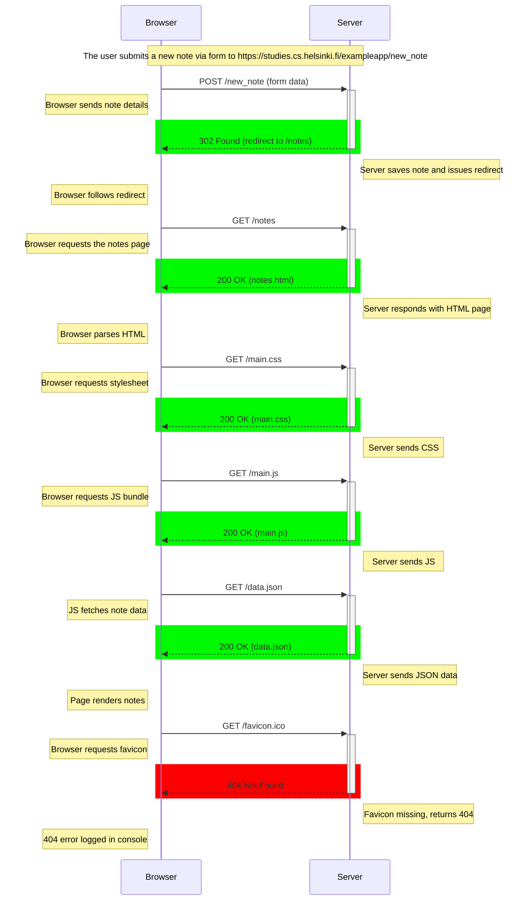

```mermaid
sequenceDiagram
    participant Browser
    participant Server

    Note over Browser, Server: The user submits a new note via form to https://studies.cs.helsinki.fi/exampleapp/new_note

    Browser->>+Server: POST /new_note (form data)
    activate Server
    Note left of Browser: Browser sends note details
    rect rgb(0,250,0)
    Server-->>-Browser: 302 Found (redirect to /notes)
    deactivate Server
    end
    Note right of Server: Server saves note and issues redirect
    Note left of Browser: Browser follows redirect

    Browser->>+Server: GET /notes
    activate Server
    Note left of Browser: Browser requests the notes page
    rect rgb(0,250,0)
    Server-->>-Browser: 200 OK (notes.html)
    deactivate Server
    end
    Note right of Server: Server responds with HTML page
    Note left of Browser: Browser parses HTML

    Browser->>+Server: GET /main.css
    activate Server
    Note left of Browser: Browser requests stylesheet
    rect rgb(0,250,0)
    Server-->>-Browser: 200 OK (main.css)
    deactivate Server
    end
    Note right of Server: Server sends CSS

    Browser->>+Server: GET /main.js
    activate Server
    Note left of Browser: Browser requests JS bundle
    rect rgb(0,250,0)
    Server-->>-Browser: 200 OK (main.js)
    deactivate Server
    end
    Note right of Server: Server sends JS

    Browser->>+Server: GET /data.json
    activate Server
    Note left of Browser: JS fetches note data
    rect rgb(0,250,0)
    Server-->>-Browser: 200 OK (data.json)
    deactivate Server
    end
    Note right of Server: Server sends JSON data
    Note left of Browser: Page renders notes

    Browser->>+Server: GET /favicon.ico
    activate Server
    Note left of Browser: Browser requests favicon
    rect rgb(250,0,0)
    Server-->>-Browser: 404 Not Found
    deactivate Server
    end
    Note right of Server: Favicon missing, returns 404
    Note left of Browser: 404 error logged in console
```