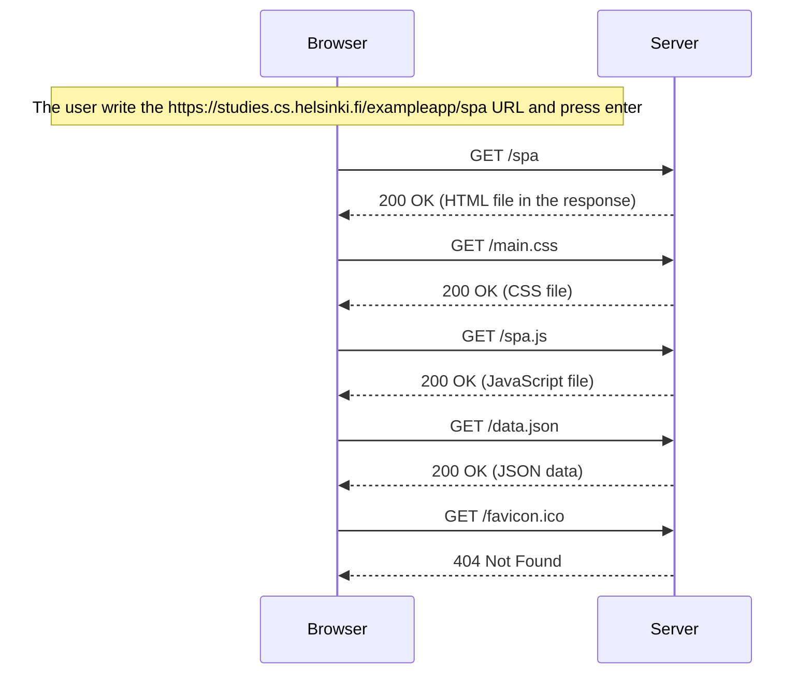

```mermaid
sequenceDiagram
    participant Browser
    participant Server

    Note over Browser: The user write the https://studies.cs.helsinki.fi/exampleapp/spa URL and press enter

    %% The browser rquest the HTML document to the server
    Browser->>Server: GET /spa
    %% The server sends the HTML to the browser
    Server-->>Browser: 200 OK (HTML file in the response)
    %% The browser load the HTML

    %% Dado que se le indica al documento HTML que realice una nueva solicitud, el navegador solicita el archivo CSS.
    Browser->>Server: GET /main.css
    %% The server send the CSS file
    Server-->>Browser: 200 OK (CSS file)

    %% The browser request the JS file
    Browser->>Server: GET /spa.js
    %% The server send the JS file
    Server-->>Browser: 200 OK (JavaScript file)

    %% JS request and process the updated data
    Browser->>Server: GET /data.json
    %% The server send the data.json
    Server-->>Browser: 200 OK (JSON data)

    %% The browser request the favicon
    Browser->>Server: GET /favicon.ico
    %% Favicon doesnt exists: 404 error showed as response and printed in console 
    Server-->>Browser: 404 Not Found
	
```