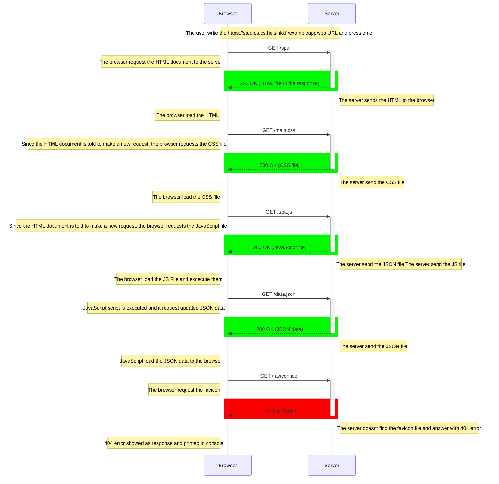

```mermaid
sequenceDiagram
    participant Browser
    participant Server

    Note over Browser, Server: The user write the https://studies.cs.helsinki.fi/exampleapp/spa URL and press enter

    Browser->>+Server: GET /spa
    activate Server
    Note left of Browser: The browser request the HTML document to the server
    rect rgb(0, 250, 0)
    Server-->>-Browser: 200 OK (HTML file in the response)
    deactivate Server
    end
    Note right of Server: The server sends the HTML to the browser
    Note left of Browser: The browser load the HTML


    Browser->>+Server: GET /main.css
    activate Server
    Note left of Browser: Since the HTML document is told to make a new request, the browser requests the CSS file
    rect rgb(0, 250, 0)
    Server-->>-Browser: 200 OK (CSS file)
    deactivate Server
    end
    Note right of Server: The server send the CSS file
    Note left of Browser: The browser load the CSS file


    Browser->>+Server: GET /spa.js
    activate Server
    Note left of Browser: Since the HTML document is told to make a new request, the browser requests the JavaScript file
    rect rgb(0, 250, 0)
    Server-->>-Browser: 200 OK (JavaScript file)
    deactivate Server
    end
    Note right of Server: The server send the JSON file The server send the JS file
    Note left of Browser: The browser load the JS File and excecute them

    Browser->>+Server: GET /data.json
    activate Server
    Note left of Browser: JavaScript script is executed and it request updated JSON data
    rect rgb(0, 250, 0)
    Server-->>-Browser: 200 OK (JSON data)
    deactivate Server
    end
    Note right of Server: The server send the JSON file
    Note left of Browser: JavaScript load the JSON data to the browser

    Browser->>+Server: GET /favicon.ico
    activate Server
    Note left of Browser: The browser request the favicon
    rect rgb(250, 0, 0)
    Server-->>-Browser: 404 Not Found
    deactivate Server
    end
        Note right of Server: The server doesnt find the favicon file and answer with 404 error
    Note left of Browser: 404 error showed as response and printed in console 
```