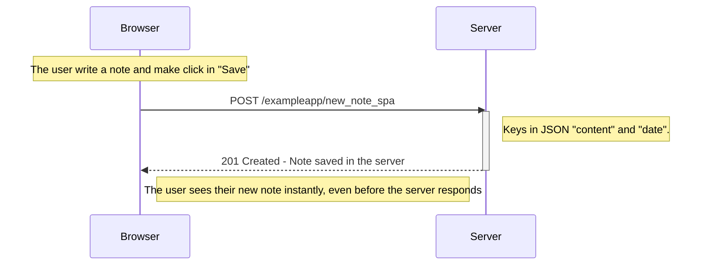

```mermaid
sequenceDiagram
    participant Browser
    participant Server

    Note over Browser: The user write a note and make click in "Save"

    Browser->>Server: POST /exampleapp/new_note_spa
    activate Server
    Note right of Server: Keys in JSON "content" and "date".

    Server-->>Browser: 201 Created - Note saved in the server
    deactivate Server

    Note right of Browser: The user sees their new note instantly, even before the server responds
```